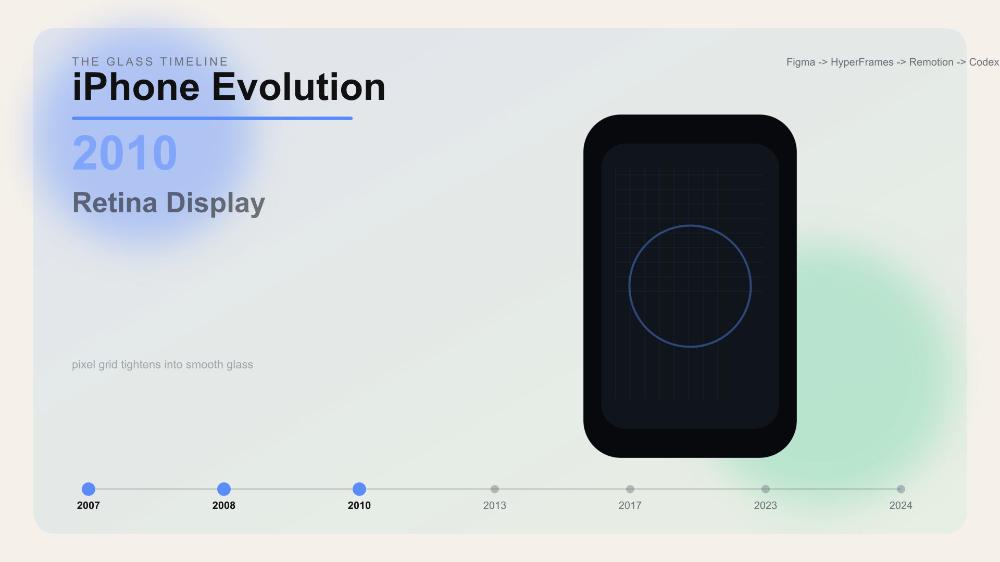

<picture>
  <source media="(prefers-color-scheme: dark)" srcset="case-studies/spacex-ascent/renders/cover.png">
  
</picture>

# Codex Video Director

An installable Codex skill for turning factual timelines, product histories, and cultural stories into cinematic coded videos.

It is not a prompt pack. It is a production method: **Figma sets direction, HyperFrames creates cinematic HTML motion, Remotion renders data-driven timelines, and Codex assembles the story into a reusable skill package.**

## Watch the Case Studies

| iPhone Evolution | SpaceX Ascent | AI Interface Futures |
|---|---|---|
| Product history as museum-tech editorial. | Aerospace milestones as mission-control documentary. | The skill explains itself as an agentic interface chain. |
| [MP4](case-studies/iphone-evolution/renders/demo.mp4) · [GIF](case-studies/iphone-evolution/renders/demo.gif) | [MP4](case-studies/spacex-ascent/renders/demo.mp4) · [GIF](case-studies/spacex-ascent/renders/demo.gif) | [MP4](case-studies/ai-interface-futures/renders/demo.mp4) · [GIF](case-studies/ai-interface-futures/renders/demo.gif) |

## How the Skill Decides Tools

- **Figma**: moodboard, storyboard frames, visual system, README cover direction.
- **HyperFrames**: cinematic HTML motion, title cards, overlays, captions, transitions.
- **Remotion**: React component video, JSON-driven timelines, milestone cards, batchable exports.
- **Codex**: research, repo assembly, code reconstruction, validation, release packaging.

## Create Your Own Timeline Video

Start with a `timeline.story.json`:

```json
{
  "title": "Product History",
  "durationSeconds": 60,
  "style": "museum-tech-editorial",
  "milestones": [
    {
      "year": "2007",
      "label": "Original iPhone",
      "meaning": "Multi-touch turns the phone into a software canvas",
      "visual": "black glass slab, keynote light, single touch ripple"
    }
  ]
}
```

Then ask Codex Video Director to research sources, create the Figma brief, route the stack, build HyperFrames/Remotion scenes, and export the final video.

## Install

After downloading the release asset:

```bash
mkdir -p "$HOME/.codex/skills"
unzip codex-video-director.skill -d "$HOME/.codex/skills/codex-video-director"
```

Restart Codex so the new skill appears in the available skill list.

## Validate and Render

```bash
npm run validate
npm run lint:hyperframes
npm run remotion:compositions
npm run render:remotion-stills
npm run render:case-studies
npm run render:demo
npm run package:skill
```

Requirements for full rendering: Node.js, `rsvg-convert`, FFmpeg, and Remotion's Chrome Headless Shell download.

## Repository Layout

```text
skills/codex-video-director/   # installable skill source
case-studies/                  # flagship cinematic demos
demo/                          # legacy/simple demos
docs/research/                 # source notes and project references
docs/design-system/            # visual system guidance
hyperframes/index.html         # HyperFrames composition board
index.html                     # root HyperFrames CLI entry
dist/                          # packaged .skill release asset
```

## Why It Stands Out

- It ships a real `.skill` package.
- It proves the workflow through concrete factual stories, not generic scenes.
- It keeps video content editable because text, charts, and milestones are code-rendered.
- It uses Figma, HyperFrames, Remotion, and Codex as a coherent production chain.
