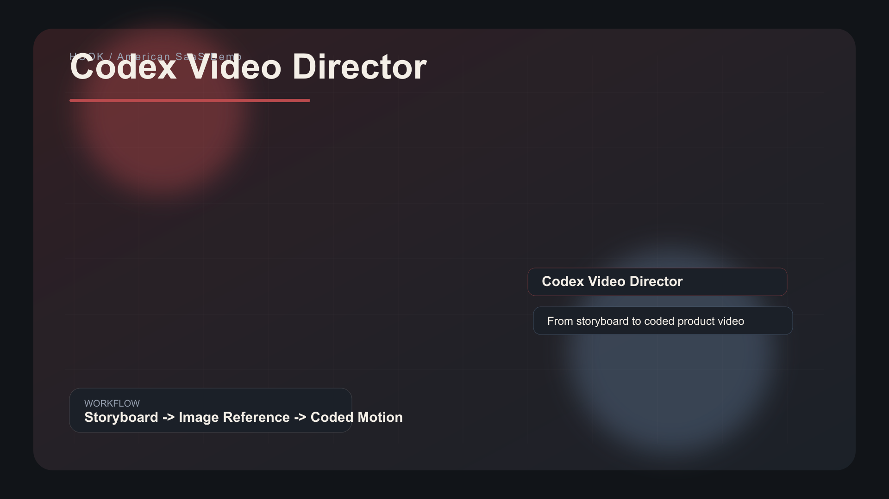

<picture>
  <source media="(prefers-color-scheme: dark)" srcset="demo/american-saas/renders/cover.png">
  
</picture>

# Codex Video Director

An installable Codex skill for turning storyboard intent, ChatGPT-generated visual references, and code reconstruction into editable product videos.

It is built around one principle: **decide the visual first, then rebuild the motion scene in code.**

## Dual Demo

| American SaaS | Japanese Editorial |
|---|---|
| Calm B2B launch video, graphite UI, analytics proof, founder layer. | Anime editorial workflow video, warm paper, magazine panels, creator layer. |
| `demo/american-saas/renders/demo.mp4` | `demo/japanese-editorial/renders/demo.mp4` |

## Workflow

```text
Storyboard -> ChatGPT image reference -> Codex coded scene -> visual QA -> MP4/GIF export
```

The generated image does not become the final video. It becomes the visual target. Text, metrics, UI cards, charts, and motion are rebuilt in code so the final scene is editable.

## Install

After downloading the release asset:

```bash
mkdir -p "$HOME/.codex/skills"
unzip codex-video-director.skill -d "$HOME/.codex/skills/codex-video-director"
```

Restart Codex so the new skill appears in the available skill list.

## Use

Ask for tasks like:

```text
Use codex-video-director to create a 35-second product demo for my AI knowledge base.
Make one American SaaS version and one Japanese editorial version.
Generate reference images first, then rebuild text, UI, and animation in code.
```

## Repository Layout

```text
skills/codex-video-director/   # installable skill source
demo/american-saas/            # polished B2B product demo
demo/japanese-editorial/       # anime editorial demo
brand-board/                   # visual board for GitHub/Figma presentation
scripts/                       # validation and demo rendering
dist/                          # packaged .skill release asset
```

## Validate and Render

```bash
npm run validate
npm run render:demo
npm run package:skill
```

Requirements for full demo rendering: Node.js and ffmpeg.

## Why It Stands Out

- It ships a real `.skill` package, not just a prompt collection.
- It proves the workflow with two different visual languages.
- It keeps the final video editable because important content is rebuilt in code.
- It includes reusable storyboard, scene-plan, and Codex implementation templates.
