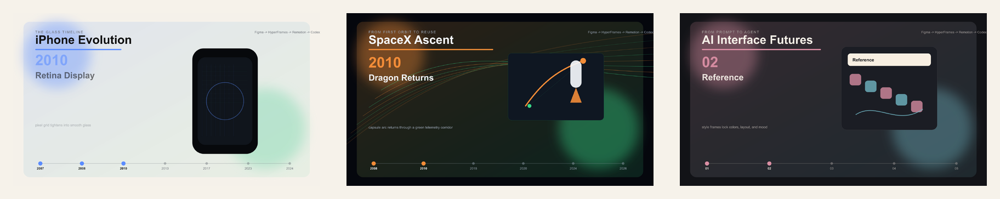

# Cinematic Case Study Design System

## Design Goal

Make factual timelines feel like museum-grade video essays: restrained, specific, and engineered.

## Case Study Cover Board

## Shared Rules

- Use abstracted visuals, not official logos or product photography.
- Show one idea per scene.
- Keep all important text editable in code.
- Treat dates as anchors, not decoration.
- Every factual milestone must appear in `sources.md`.

## Visual Modes

### Museum Tech Editorial

- Use for iPhone Evolution.
- Palette: porcelain white, black glass, soft silver, keynote blue, signal green.
- Motion: light sweeps, device silhouettes, pixel grids, glass reflections.

### Mission Control Documentary

- Use for SpaceX Ascent.
- Palette: deep space black, telemetry green, launch amber, oxygen white.
- Motion: orbital arcs, burn trails, countdown cards, mission board reveals.

### Agentic Interface Studio

- Use for AI Interface Futures.
- Palette: graphite, warm ivory, sakura, cyan, muted red.
- Motion: prompt cursor, reference frames, code panels, render cards, GitHub release badge.

## Plugin Roles

- Figma creates moodboards, style frames, storyboard boards, and README cover systems.
- HyperFrames creates cinematic HTML sequences, title cards, overlays, captions, and transitions.
- Remotion creates data-driven React timelines, milestone cards, charts, and parameterized exports.
- Codex orchestrates the workflow and keeps the output editable.
